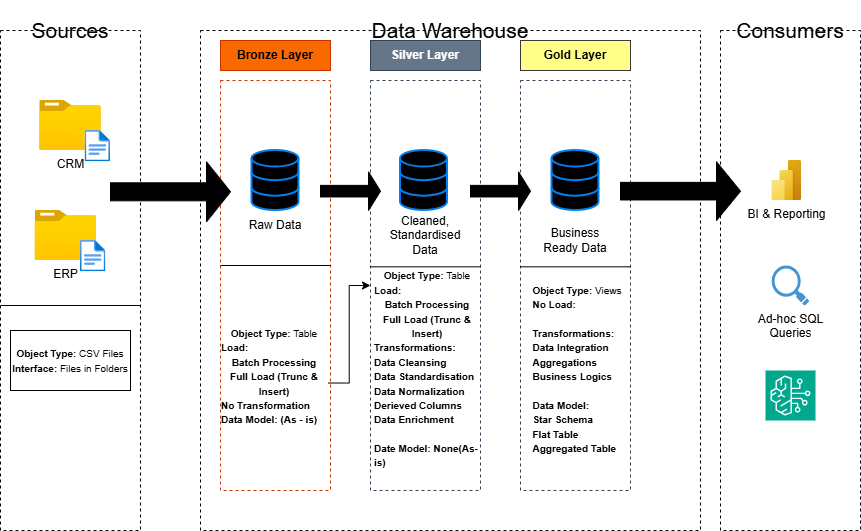

# Data Warehouse and Analytics Project

Welcome to the **Data Warehouse and Analytics Project** repository! 🚀

This project demonstrates a complete **Data Warehouse and Analytics Solution** using **SQL Server**. It covers the full lifecycle of a modern analytics project — from importing raw data files to building a clean analytical data model and generating business insights through SQL.

This repository is created as a **portfolio project** to strengthen practical skills in:

- Data Engineering  
- SQL Development  
- ETL Processes  
- Data Modeling  
- Business Intelligence  
- Analytical Problem Solving

---
## 🏗️ Data Architecture

The data architecture for this project follows Medallion Architecture **Bronze**, **Silver**, and **Gold** layers:

1. **Bronze Layer**: Stores raw data as-is from the source systems. Data is ingested from CSV Files into SQL Server Database.
2. **Silver Layer**: This layer includes data cleansing, standardization, and normalization processes to prepare data for analysis.
3. **Gold Layer**: Houses business-ready data modeled into a star schema required for reporting and analytics.

---

> 📌 **Learning Source / Inspiration**  
> This project is being built by following the tutorial series of **Data With Baraa** on YouTube.  
> Full credit for the original project structure, concepts, and guidance goes to **Baraa Khatib Salkini**.

---

# 📖 Project Overview

Businesses often store data in multiple systems such as CRM, ERP, spreadsheets, or transaction databases. This project focuses on combining that fragmented data into one centralized **SQL Server Data Warehouse** that can be used for reporting and decision-making.

The complete workflow includes:

1. Importing raw CSV data files  
2. Cleaning and validating source data  
3. Designing staging, warehouse, and analytics layers  
4. Creating fact and dimension tables  
5. Writing ETL SQL scripts  
6. Running analytical SQL queries  
7. Producing business insights and KPIs  

---

# 🎯 Project Objectives

## Data Engineering Objectives

Build a structured and scalable **SQL Server Data Warehouse** by integrating data from multiple business sources.

### Goals:

- Consolidate raw data from ERP and CRM systems  
- Clean and standardize inconsistent records  
- Remove duplicates and null-value issues  
- Create optimized warehouse tables  
- Design star-schema style models  
- Enable fast reporting queries  

---

## Data Analytics Objectives

Use SQL queries to answer business questions and generate insights related to:

- Customer Behavior  
- Product Performance  
- Revenue Growth  
- Sales Trends  
- Regional Performance  
- Top Customers  
- Top Selling Products  
- Monthly Trends  
- Business KPIs  

---

# 🛠️ Tech Stack

| Category | Technology |
|----------|------------|
| Database | SQL Server |
| Query Language | T-SQL |
| Data Source | CSV Files |
| ETL | SQL Server Scripts |
| Modeling | Star Schema |
| Reporting | SQL Queries |
| Version Control | Git + GitHub |

---

# 🙌 Credits

Special thanks to **Data With Baraa** for creating one of the best practical learning projects for aspiring Data Analysts and Data Engineers.  

This repository is my own implementation using **SQL Server** while learning from the tutorial.

---

# 🛡️ License

This project is for educational and portfolio purposes.  

Original tutorial idea belongs to **Data With Baraa**.

---

# 🌟 About Me

Hi, I'm **Josee** 👋  

I am passionate about building strong practical skills in the field of data and technology through hands-on projects and continuous learning. My focus is on developing real-world expertise in:

- Data Analytics  
- SQL  
- SQL Server  
- Data Engineering  
- ETL Processes  
- Data Warehousing  
- Business Intelligence  
- Reporting & Dashboarding  

I enjoy solving business problems with data, improving my analytical thinking, and creating projects that reflect industry-level practices.

This repository is part of my learning journey to become highly skilled in the world of data. 🚀
